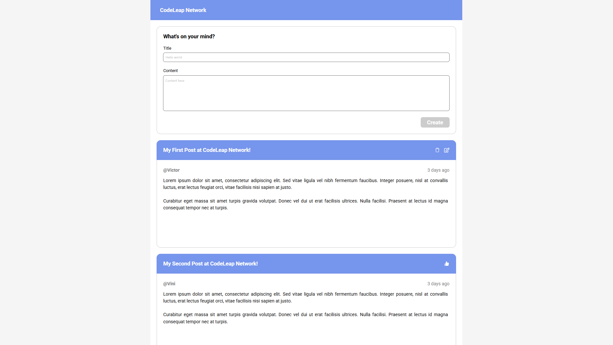
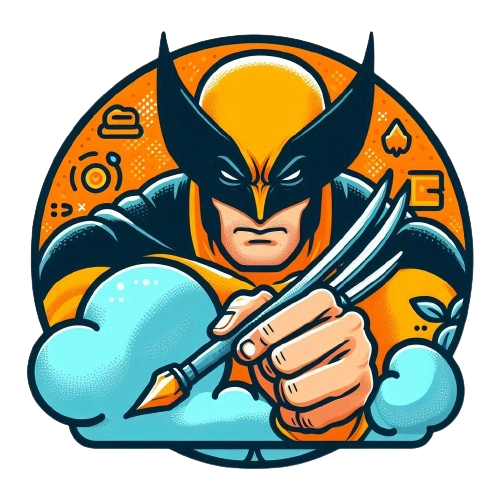

    

# CodeLeap Engineering Test

> ℹ️ **NOTE:** This repository was developed during the CodeLeap selection process. This project will be continuously improved to enhance performance and code optimization.

## ✨ Features
✅ Welcome! This project aims to create a user message posting application in React, with functionalities to retrieve, create, update, and delete user posts. I am grateful to God for the completion of this project.

<a href="https://code-leap-project-eight.vercel.app/" title="View Project now"> 📟 Click here to view the application</a> 
<a href="https://github.com/VictorSamuraiWol/code_leap_project" title="View Repository now"> 📜 Click here to view the repository</a>

## 💻 Technologies used in the project

- [Visual Studio Code](https://code.visualstudio.com/)
- [HTML](https://html.com/) 
- [CSS](https://www.w3.org/Style/CSS/Overview.en.html)
- [JavaScript](https://www.javascript.com/)
- [React](https://react.dev/)
- [React Icons](https://react-icons.github.io/react-icons/)
- [Json-Server](https://www.npmjs.com/package/json-server)
- [ChatGPT](https://chatgpt.com/)
- [Github](https://github.com/)
- [Trello](https://trello.com/pt-BR)
- [Vercel](https://vercel.com/)

##  AWS and Oracle Certified in Cloud Computing, Front-End Student 
 

    
    
&nbsp&nbsp&nbspVictor Cardoso 
    &nbsp&nbsp&nbsp
    <a 
        href="https://github.com/VictorSamuraiWol">
        GitHub
    </a>
    &nbsp;|&nbsp;
    <a 
        href="https://www.linkedin.com/in/victor-cardoso-cloud-front/">
        LinkedIn
    </a>
    &nbsp;|&nbsp;
    

 

---

⌨️ with 💚 by [Victor Cardoso](https://github.com/VictorSamuraiWol)
